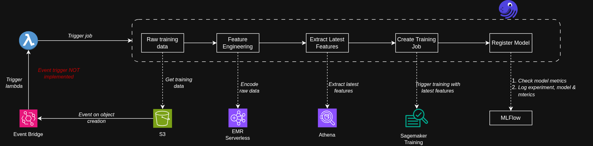
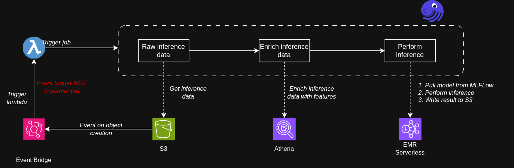

# End-to-End MLOps Pipeline on AWS with Dagster, EMR Serverless, Athena, SageMaker, and Managed MLflow

This repository demonstrates an end-to-end MLOps workflow for **continuous training** and **continuous inference** on AWS.

It uses **Dagster assets** for orchestration and lineage, **Dagster Pipes** for visibility into external compute, **EMR Serverless** for scalable data processing and inference, **Athena** for feature enrichment queries, **SageMaker** for training, and **AWS Managed MLflow** for experiment tracking and model registry.

---

## Architecture

### Continuous Training



### Inference



### Global Asset Lineage


---

## Repository Structure

```text
.
├── code/
│   ├── src/              # Transform, training, and inference source code
│   └── deployment/      # Manual scripts to package and deploy code
├── dags/                 # Dagster jobs and asset definitions
├── tofu/                 # IaC for IAM roles/policies, EMR, and MLflow infrastructure
├── images/               # Architecture and lineage screenshots
└── README.md
```

---

## Overview

This project implements two core workflows:

1. **Continuous Training**
2. **Continuous Inference**

Each step materializes metadata to make the pipeline observable, traceable, and easier to operate.

---

## Continuous Training Flow

### 1. Training data asset

A Dagster asset represents the raw training data.

### 2. Feature engineering with EMR Serverless

A Dagster asset launches an **EMR Serverless** job using **Dagster Pipes** to:

- impute missing values
- encode categorical features
- write features to an **offline feature store** in S3

**Materialized outputs:**

- EMR job ID
- offline feature store S3 path

### 3. Enriched training data with Athena

Since the offline feature store is an **append log**, the pipeline runs an **Athena query** to retrieve the latest value for each feature and writes the result to S3.

This output is used as the enriched training dataset.

**Materialized outputs:**

- Athena query
- enriched training data S3 location

### 4. Model training and evaluation with SageMaker

The pipeline launches a **SageMaker training job** to train and evaluate a `scikit-learn` classification model.

It logs the experiment, run metadata, model artifacts, and evaluation metrics to **AWS Managed MLflow**.

**Materialized outputs:**

- MLflow run ID
- MLflow artifact path

### 5. Model registration and promotion

The pipeline reads model metrics from MLflow and applies a promotion rule.

If accuracy meets the threshold, it:

- registers the model
- promotes it to **champion**

**Materialized outputs:**

- registered model name
- registered model version

---

## Continuous Inference Flow

### 1. Raw inference data asset

A Dagster asset represents the raw inference data.

### 2. Inference data enrichment

The pipeline joins inference data with the offline feature store to produce a feature-complete dataset for prediction.

This step uses **Athena** and writes the enriched dataset to S3.

**Materialized outputs:**

- Athena query
- enriched inference data S3 location

### 3. Batch inference with EMR Serverless

A Dagster asset launches an **EMR Serverless** job using **Dagster Pipes** to:

- load the promoted model from the **MLflow Model Registry**
- run batch scoring with an **MLflow UDF**
- write predictions to S3

**Materialized outputs:**

- prediction results S3 location

---

## Design Choices

### Why Dagster?

I chose **Dagster** because it provides:

- native asset-based orchestration
- built-in lineage
- materialization metadata for every step
- a clean way to model ML systems as data products

### Why Dagster Pipes?

I used **Dagster Pipes** wherever possible so external compute systems such as EMR Serverless remain visible from Dagster.

This improves:

- observability
- debugging
- runtime metadata tracking
- integration between orchestration and execution layers

### Why EMR Serverless for inference?

I chose **EMR Serverless** for inference because it is more scalable for distributed batch workloads.

This is especially useful when:

- inference volume is large
- data is already in S3
- Spark-based processing is part of the scoring pipeline

### Why Athena for feature enrichment?

Because the offline feature store is implemented as an **append log**, I need a query layer to compute the latest valid feature values for downstream training and inference.

Athena provides a simple and serverless way to do that over S3-backed data.

---

## Production Readiness Gaps / Next Steps

To make this repository production-ready, the next improvements are:

### 1. CI/CD
Add CI/CD pipelines for EMR transform and inference code, training code, and Dagster deployment code. Add stronger champion/challenger promotion and rollback support.

### 2. IAM hardening
Lock down IAM permissions using the **principle of least privilege** across S3, Athena, EMR Serverless, SageMaker, and MLflow access.

### 3. Testing strategy
Add unit and integration tests for transformations, orchestration logic, and pipeline components.

### 4. Online feature store
Add an online feature store and support for real-time inference.

### 5. Event triggers
Automatically trigger training and inference workflows when new data lands in S3.

---

## Materialized Metadata Across the Pipeline

One of the key goals of this project is to materialize useful operational metadata at each stage of the workflow.

Examples include:

- EMR job IDs
- Athena queries
- S3 output paths
- MLflow run IDs
- artifact locations
- registered model names and versions

This makes the pipeline easier to:

- debug
- audit
- observe
- explain to stakeholders

---

## Tech Stack

- **Dagster**
- **Dagster Pipes**
- **Amazon EMR Serverless**
- **Amazon Athena**
- **Amazon S3**
- **Amazon SageMaker**
- **AWS Managed MLflow**
- **scikit-learn**
- **PySpark**

---

## What This Repo Demonstrates

This project is meant to show how to build a practical ML platform workflow that combines:

- asset-based orchestration
- external compute orchestration with visibility
- offline feature enrichment
- model training and evaluation
- experiment tracking
- model registration and promotion
- scalable batch inference

---

## Disclaimer

This project is a reference implementation intended to demonstrate architecture and workflow design choices for production-style MLOps systems on AWS.